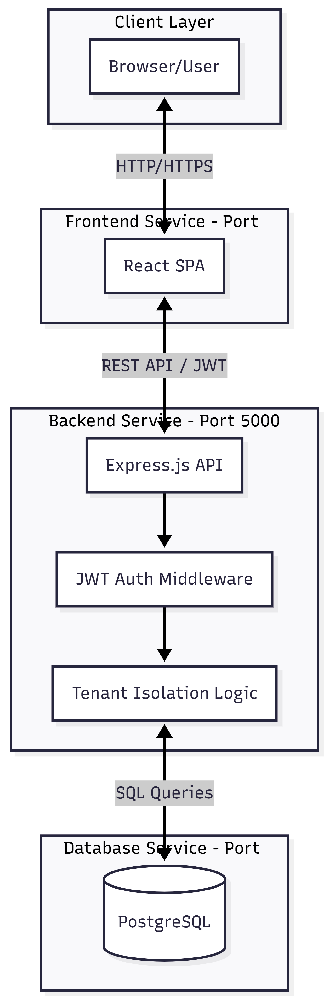

# Multi-Tenant SaaS Platform

## Project Overview
A production-ready, multi-tenant SaaS application designed to help multiple organizations manage their teams, projects, and tasks independently. The system ensures complete strict data isolation between tenants, implements RBAC (Role-Based Access Control), and enforces subscription plan limits.

## Key Features
*   **Multi-Tenancy**: Shared database with strictly isolated data per tenant using `tenant_id`.
*   **Authentication**: Secure JWT-based auth with auto-logout and 24h expiry.
*   **Role-Based Access (RBAC)**: Distinct permissions for Super Admin, Tenant Admin, and Users.
*   **Subscription Management**: Automatic enforcement of User and Project limits based on plans (Free, Pro, Enterprise).
*   **Audit Logging**: Immutable logs for critical actions like User Creation and Project Deletion.
*   **Responsive UI**: Fully responsive Dashboard, Project Boards, and User Management tables.
*   **Dockerized**: Complete one-command deployment for DB, Backend, and Frontend.

## Technology Stack
*   **Frontend**: React.js 18 (Vite), Vanilla CSS (Variables & Design System)
*   **Backend**: Node.js, Express.js
*   **Database**: PostgreSQL 15
*   **Containerization**: Docker, Docker Compose

## Architecture Overview
The system follows a 3-tier architecture with a central PostgreSQL database. Tenant isolation is enforced at the middleware layer to prevent cross-tenant data leaks.


## Installation & Setup

### Prerequisites
*   Docker Desktop installed and running.

### Quick Start
1.  **Clone the repository**:
    ```bash
    git clone github.com/maharshi0143/Multi-Tenant-SaaS-Platform-with-Project-Task-Management.git
    cd Multi-Tenant-SaaS-Platform-with-Project-Task-Management
    ```
2.  **Start the Application**:
    Run the following command in the root directory:
    ```bash
    docker-compose up --build -d
    ```
3.  **Access the App**:
    *   **Frontend**: [http://localhost:3000](http://localhost:3000)
    *   **Backend Health**: [http://localhost:5000/api/health](http://localhost:5000/api/health)

### Running Tests
To run the automated test suite inside the container:
```bash
docker-compose exec backend npm test
```

## API Documentation
Full API documentation for all 19 endpoints is available in [`docs/API.md`](./docs/API.md).

## Default Credentials
For testing, use the capabilities defined in `submission.json`:
*   **Super Admin**: `superadmin@system.com` / `Admin@123`
*   **Tenant Admin**: `admin@demo.com` / `Demo@123` (Tenant: `demo`)
*   **User**: `user1@demo.com` / `User@123`

## Demo Video
[Watch the Project Demo](https://drive.google.com/file/d/1_DAgqJRgKvak69LVzO8HpkScm2mzGZ8C/view?usp=sharing)
