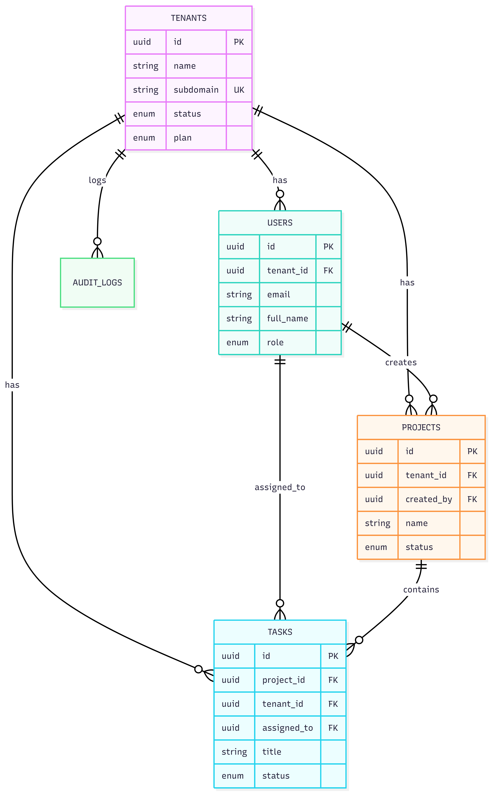

# System Architecture Document

## 1. System Architecture Diagram
The system follows a three-tier architecture ensuring complete separation of concerns and data isolation.

* **Client (Browser)**: Interface where users interact with the platform.
* **Frontend Application**: React-based SPA served on port 3000, managing the UI and local state.
* **Backend API Server**: Node.js/Express server on port 5000, handling authentication, authorization, and business logic.
* **Database**: PostgreSQL server on port 5432, storing all tenant, user, project, and task data.
* **Authentication Flow**: JWT-based stateless authentication with a 24-hour expiry.

*(Note: Please ensure your diagram at this path shows the flow from Client -> Frontend -> Backend -> Database)*

---

## 2. Database Schema Design (ERD)
The database uses a shared-schema multi-tenant approach where data is isolated using a mandatory `tenant_id` column.

### Core Tables & Relationships
* **tenants**: Root table for all organizations.
* **users**: Team members. Linked to `tenants` via `tenant_id` (NULL for super_admin).
* **projects**: Workspaces. Linked to `tenants` via `tenant_id` and `users` via `created_by`.
* **tasks**: Individual items. Linked to `tenants` via `tenant_id` and `projects` via `project_id`.
* **audit_logs**: Immutable logs for security. Linked to `tenants` via `tenant_id`.

### Highlights
* **Isolation**: All tables except `tenants` contain a `tenant_id` foreign key.
* **Foreign Keys**: Implemented with `ON DELETE CASCADE` to ensure data integrity during tenant or project removal.
* **Indexes**: Performance indexes created on all `tenant_id` columns and composite indexes on `tasks(tenant_id, project_id)`.

*(Note: Your ERD at this path should highlight the tenant_id isolation pattern and foreign key links)*

---

## 3. API Architecture
The system exposes 19 RESTful endpoints organized by module.

### Module 3.1: Authentication
| Method | Endpoint | Auth Required | Role Required |
| :--- | :--- | :--- | :--- |
| POST | `/api/auth/register-tenant` | No | Public |
| POST | `/api/auth/login` | No | Public |
| GET | `/api/auth/me` | Yes | Any |
| POST | `/api/auth/logout` | Yes | Any |

### Module 3.2: Tenant Management
| Method | Endpoint | Auth Required | Role Required |
| :--- | :--- | :--- | :--- |
| GET | `/api/tenants/:tenantId` | Yes | Tenant Admin / Super Admin |
| PUT | `/api/tenants/:tenantId` | Yes | Tenant Admin / Super Admin |
| GET | `/api/tenants` | Yes | Super Admin Only |

### Module 3.3: User Management
| Method | Endpoint | Auth Required | Role Required |
| :--- | :--- | :--- | :--- |
| POST | `/api/tenants/:tenantId/users` | Yes | Tenant Admin |
| GET | `/api/tenants/:tenantId/users` | Yes | Any (within tenant) |
| PUT | `/api/users/:userId` | Yes | Tenant Admin / Self |
| DELETE | `/api/users/:userId` | Yes | Tenant Admin |

### Module 3.4: Project Management
| Method | Endpoint | Auth Required | Role Required |
| :--- | :--- | :--- | :--- |
| POST | `/api/projects` | Yes | Any (within tenant) |
| GET | `/api/projects` | Yes | Any (within tenant) |
| PUT | `/api/projects/:projectId` | Yes | Creator / Tenant Admin |
| DELETE | `/api/projects/:projectId` | Yes | Creator / Tenant Admin |

### Module 3.5: Task Management
| Method | Endpoint | Auth Required | Role Required |
| :--- | :--- | :--- | :--- |
| POST | `/api/projects/:projectId/tasks` | Yes | Any (within tenant) |
| GET | `/api/projects/:projectId/tasks` | Yes | Any (within tenant) |
| PATCH | `/api/tasks/:taskId/status` | Yes | Any (within tenant) |
| PUT | `/api/tasks/:taskId` | Yes | Any (within tenant) |